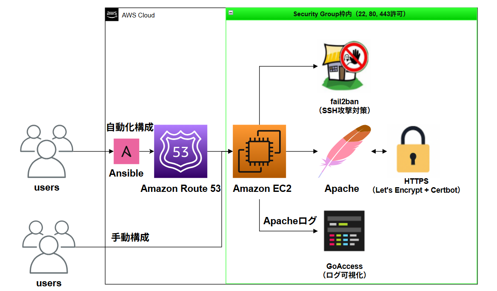

# EC2 + HTTPS サーバ構築ポートフォリオ

## 🔧 Webサイト作成・管理（HTTPS対応）

LPICを勉強して、実際にAWSのサーバ（EC2）でWebサイトを作ってみた記録です。
できるだけ実務に近い構成を自分で調べながら作りました。

---

### 🌐 サイトURL

* [https://mytest-portfolio.xyz](https://mytest-portfolio.xyz)
* [https://mytest-portfolio.xyz/secret](https://mytest-portfolio.xyz/secret)  - (Basic認証あり）
* [https://mytest-portfolio.xyz/report.html](https://mytest-portfolio.xyz/report.html) - サンプルレポートページ
  
---

## 🗂 サーバ構成図

以下は、Amazon EC2 上に構築した Web サーバの全体構成図です。



---

### 🔐 セキュリティの工夫

* HTTPアクセスはすべてHTTPSへ自動リダイレクト
* `.htpasswd` を使って特定ページにログイン制限を設定
* fail2banでSSH攻撃対策（5回失敗でIPブロック）
* セキュリティグループ設定：22, 80, 443番ポートのみ開放
* `/etc/ssh/sshd_config` にて `PermitRootLogin no` 設定済み（rootログイン無効化）
* パスワードログインを無効化（`PasswordAuthentication no`）し、鍵認証のみに限定
* IP直打ちアクセスは403で拒否（FQDNアクセスのみ許可）

---

### 📊 アクセスログの見える化

`goaccess` を使って、ApacheのアクセスログをHTMLでグラフ化しました。
Webブラウザからアクセス解析の可視化が可能です。

---

## 🔹 手動構築構成（LPICスキル活用）

### 🛠 開発環境

* Amazon EC2（Amazon Linux 2023）
* Apache（Webサーバ）
* お名前.com で取得した独自ドメイン
* Certbot（Let's Encrypt）でHTTPS化 → 自動更新はcronで実施
* Basic認証（.htpasswd）でログイン制限 → `/secret` のみに適用
* fail2ban（SSHの攻撃対策）→ 5回ログイン失敗で一時BAN
* goaccess（アクセスログのグラフ表示）
* GitHub（コードと設定を管理）

### 📁 フォルダ構成（設定・Web・セキュリティ）

```plaintext
/var/www/html/
├── index.html          # トップページ
├── report.html         # サンプルページ
└── secret/             # Basic認証エリア（.htaccessで制限）

/etc/httpd/
├── conf/               # Apacheのメイン設定（httpd.conf）
├── conf.d/             # HTTPSバーチャルホスト設定（httpd-le-ssl.conf: 443, httpd-redirect.conf: 80）
├── conf.modules.d/     # Apacheモジュール構成

/etc/letsencrypt/
├── live/               # 実際に使われる証明書（fullchain.pem, privkey.pem）
├── archive/            # 証明書の履歴（過去分）
├── renewal/            # 自動更新の設定ファイル
├── cli.ini             # certbot CLI設定

/etc/fail2ban/
├── jail.d/             # jailルール設定（例：sshd.conf）
├── filter.d/           # フィルタ定義（ログのパターン）
├── fail2ban.conf       # 本体設定
```

---

## ⚙️ 自動化構成（Ansible + Route 53）

Ansibleでサーバ構築を自動化し、Route 53でDNS設定も一元管理しています。

# EC2 + HTTPS サーバ構築ポートフォリオ

## 🔧 Webサイト作成・管理（HTTPS対応）

LPICを勉強して、実際にAWSのサーバ（EC2）でWebサイトを作ってみた記録です。
できるだけ実務に近い構成を自分で調べながら作りました。

---

### 🌐 サイトURL

* [https://mytest-portfolio.xyz](https://mytest-portfolio.xyz)
* [https://mytest-portfolio.xyz/secret](https://mytest-portfolio.xyz/secret)  - (Basic認証あり）
* [https://mytest-portfolio.xyz/report.html](https://mytest-portfolio.xyz/report.html) - サンプルレポートページ
  
---

## 🗂 サーバ構成図

以下は、Amazon EC2 上に構築した Web サーバの全体構成図です。


---

### 🔐 セキュリティの工夫

* HTTPアクセスはすべてHTTPSへ自動リダイレクト
* `.htpasswd` を使って特定ページにログイン制限を設定
* fail2banでSSH攻撃対策（5回失敗でIPブロック）
* セキュリティグループ設定：22, 80, 443番ポートのみ開放
* `/etc/ssh/sshd_config` にて `PermitRootLogin no` 設定済み（rootログイン無効化）
* パスワードログインを無効化（`PasswordAuthentication no`）し、鍵認証のみに限定
* IP直打ちアクセスは403で拒否（FQDNアクセスのみ許可）

---

### 📊 アクセスログの見える化

`goaccess` を使って、ApacheのアクセスログをHTMLでグラフ化しました。
Webブラウザからアクセス解析の可視化が可能です。

---

## 🔹 手動構築構成（LPICスキル活用）

### 🛠 開発環境

* Amazon EC2（Amazon Linux 2023）
* Apache（Webサーバ）
* お名前.com で取得した独自ドメイン
* Certbot（Let's Encrypt）でHTTPS化 → 自動更新はcronで実施
* Basic認証（.htpasswd）でログイン制限 → `/secret` のみに適用
* fail2ban（SSHの攻撃対策）→ 5回ログイン失敗で一時BAN
* goaccess（アクセスログのグラフ表示）
* GitHub（コードと設定を管理）

### 📁 フォルダ構成（設定・Web・セキュリティ）

```plaintext
/var/www/html/
├── index.html          # トップページ
├── report.html         # サンプルページ
└── secret/             # Basic認証エリア（.htaccessで制限）

/etc/httpd/
├── conf/               # Apacheのメイン設定（httpd.conf）
├── conf.d/             # HTTPSバーチャルホスト設定（httpd-le-ssl.conf: 443, httpd-redirect.conf: 80）
├── conf.modules.d/     # Apacheモジュール構成

/etc/letsencrypt/
├── live/               # 実際に使われる証明書（fullchain.pem, privkey.pem）
├── archive/            # 証明書の履歴（過去分）
├── renewal/            # 自動更新の設定ファイル
├── cli.ini             # certbot CLI設定

/etc/fail2ban/
├── jail.d/             # jailルール設定（例：sshd.conf）
├── filter.d/           # フィルタ定義（ログのパターン）
├── fail2ban.conf       # 本体設定
```

---

## ⚙️ 自動化構成（Ansible + Route 53）

Ansibleでサーバ構築を自動化し、Route 53でDNS設定も一元管理しています。

### 🛠 使用技術

* **Ansible**：Apache／fail2ban／goaccess／Basic認証を自動構成
* **Route 53**：Aレコード・NS・SOAなどを自動で管理し、ドメインとEC2を紐づけ

### ✅ 自動化で実現できること

* Apacheの自動インストール・HTTPS対応（Let's Encrypt）
* fail2banの導入と有効化
* Basic認証の設定（.htpasswd生成）
* goaccessをソースからビルドして可視化ページ生成
* HTTP→HTTPS リダイレクト設定

### 📁 ansibleディレクトリ構成例

```plaintext
ansible_ec2_setup/
├── site.yml                    # 各構成をまとめて呼び出すメインプレイブック
├── tasks/                      # 個別構成タスク
│   ├── setup_apache.yml
│   ├── setup_certbot.yml
│   ├── setup_fail2ban.yml
│   ├── setup_htpasswd.yml
│   ├── setup_https_redirect.yml
│   ├── setup_goaccess.yml
│   └── setup_sshd_config.yml
└── files/                      # 設定ファイルなど
